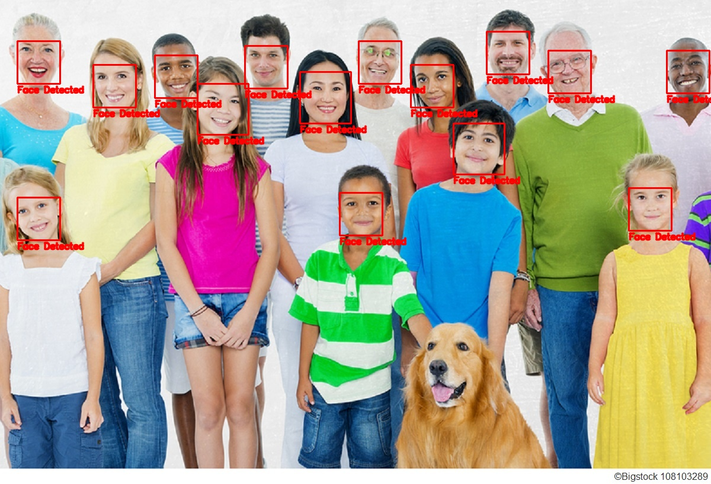
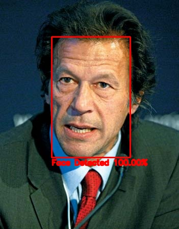

# Bleed AI Face Detector

A Python package that lets you use 4 different face detectors by just changing a single line of code.

## Usage

First import the library then choose one of the 4 provided methods of face detection and then pass in a 8 bit BGR image (Image read by opencv) and get the face detections

#### Here you can see how to use haar cascade based face detection
```
import bleedefacetector as fd

faces_list = fd.haar_detect(img)

```

The returned faces_list is a list of faces co-ordinates in this format: [x,y,w,h] 
Where x,y is the top left corner of the face and w,h are the width and height of the image respectively.

If 3 faces were detected on the example image then you would get back something like this:

[
[x1,y1,w1,h1]
[x2,y2,w2,h2]
[x3,y3.w3,h3]
]

## Here is the syntax to use all 4 face_detectors

>>  import bleedfacedetector as fd 
> * fd.haar_detect(img)  #Haar cascade/ viola jones based detection 
> * fd.hog_detect(img)   #hog (histogram of oriented gradients) based detection 
> * fd.ssd_detect(img)   #SSD + Mobilenet based detection  
> * fd._detect(img)   #CNN based detection  *(Only use this in real time when you are running on a GPU)* 

NO matter which method you use the returned faces are always in the same format [x,y,w,h]

## Face Detection Example on Image
Here is an example code in which you can detect faces using any of the methods , all you have to do is just change one line


```
import bleedfacedetector as fd
import cv2

img = cv2.imread('family.jpg')

faces = fd.ssd_detect(img)

for (x,y,w,h,) in faces:
    cv2.rectangle(img,(x,y),(x+w,y+h),(0,0,255),2)
    cv2.putText(img,'Face Detected',(x,y+h+15), cv2.FONT_HERSHEY_SIMPLEX, 0.5, (0,0,255), 2, cv2.LINE_AA)

cv2.imshow('img',img)
cv2.waitKey(0)
cv2.destroyAllWindows()
```
## Results:


So just change fd.ssd_detect(img) with any other method , note when you use any method other than ssd then consider passing height=0 for better accuracy at the cost of increased time

like this: <br>
```fd.haar_detect(img,height=0)```

* This is because I resize all images to 350 height keeping aspect ratio constant , this is to increase speed but sometimes good detections require a larger height so height = 0 means set height to original. 
* Note you can set custom height by setting height to any number, maybe if you're getting fine results try lowering the height below the defult 350 to get faster speed *
* Note the height parameter is not for SSD based method *

## Result when using hog with height=0



## Detection with Haar Cascades:
```
import bleedefacetector as fd

faces_list = fd.haar_detect(img)
faces_list = fd.haar_detect(img,scaleFactor = 1.3,minNeighbors = 5,height=350)
```
#### Optional parameters:
1.  <b> height </b>
    
 By default height resizes to 350 , you can decrease or increase height to change the speed of the alogrithim at the compromise of accuracy. Height=0 means use original height
 
 2. <b> saleFactor </b> 
    
 By default Scalefactor is equal to 1.3, This parameter speicfies how much the size reduces at each image pyramid. A large scale factor will increase the speed of the detector, but wil probably harm  true-positive detection accuracy. on the other hand a smaller scale will slow down the detection speed, but will increase true-positive detections. However, this smaller scale will possibly also increase the false-positive detection rate as well
 
 3. <b> minNeighbors </b>

Defualt value is 5. The minNeighbors parameter controls the minimum number of detected bounding boxes (in this cases 5) in a given area for the region to be classified as a face. This parameter is very helpful in when getting rid of  false-positive detections.


## Detection with HOG:
```
import bleedefacetector as fd

faces_list = fd.hog_detect(img)
faces_list = fd.hog_detect(img, upsample=0, height=350)
```
#### Optional parameters:
1.  <b> height </b>
    
 By default height resizes to 350 , you can decrease or increase height to change the speed of the alogrithim at the compromise of accuracy. Height=0 means use original height
 
 2. <b>  upsample </b> 
    
 By default upsample is equal to 0, This parameter determines how many pyramids to go up if faces in image are samll then you will have to increase its value and it will cost you speed, but accuracy may increase.
 
 
 ## Detection with CNN:
```
import bleedefacetector as fd

faces_list = fd.cnn_detect(img)
faces_list = fd.cnn_detect(img, upsample=0, height=350)
```
<i> Warning! don't run this in real time on a CPU, use a GPU for real time using CNN method </i>

#### Optional parameters:
1.  <b> height </b>
    
 By default height resizes to 350 , you can decrease or increase height to change the speed of the alogrithim at the compromise of accuracy. Height=0 means use original height
 
 2. <b>  upsample </b> 
    
 By default upsample is equal to 0, This parameter determines how many pyramids to go up if faces in image are samll then you will have to increase its value and it will cost you speed, but accuracy may increase.
 
 
  ## Detection with SSD:
```
import bleedefacetector as fd

faces_list = fd.ssd_detect(img)
faces_list = fd.ssd_detect(img, conf=0.5,returnconf=False)

```
 Warning! don't run this in real time on a CPU, use a GPU for real time using CNN method 

#### Optional parameters:
1.  <b> conf </b>
    
 By defualt its set to  0.5, this is the threshold which determines if a given detection is a face or not , decrease it to get more detections or increase it to prune false positives.
 
 2. <b>  returnconf </b> 
    
 By default upsample its set to False, if you set this parameter to True then instead of getting [x,y,w,h] you will get [x,y,w,h,c] where c is the confidence.
 
### Example code when returnconf is True:
```
import bleedfacedetector as fd
import cv2

img = cv2.imread('images/imrankhanface.jpg')

faces = fd.ssd_detect(img,returnconf=True)

for (x,y,w,h,c) in faces:
    cv2.rectangle(img,(x,y),(x+w,y+h),(0,0,255),2)
    cv2.putText(img,'Face Detected {:.2f}%'.format(c*100),(x,y+h+15), cv2.FONT_HERSHEY_SIMPLEX, 0.5, (0,0,255), 2, cv2.LINE_AA)

cv2.imshow('img',img)
cv2.waitKey(0)
cv2.destroyAllWindows()
```
Result:




